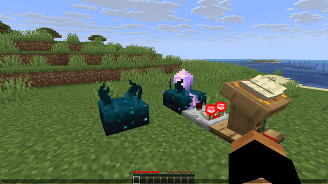

<div>
    <a href="https://modrinth.com/mod/plasmo-voice">Plasmo Voice</a>
    <span> | </span>
    <a href="https://modrinth.com/plugin/pv-addon-sculk">Modrinth</a>
    <span> | </span>
    <a href="https://github.com/plasmoapp/pv-addon-sculk/">GitHub</a>
    <span> | </span>
    <a href="https://discord.com/invite/uueEqzwCJJ">Discord</a>
     <span> | </span>
    <a href="https://www.patreon.com/plasmomc">Patreon</a>
</div>

# pv-addon-sculk

Server-side [Plasmo Voice](https://modrinth.com/mod/plasmo-voice) add-on.

With this add-on, sculk sensors are activated with proximity voice chat.

By default, proximity voice chat emits [minecraft:eat game event](https://minecraft.wiki/w/Sculk_Sensor#Redstone_emission) that represents redstone signal of `8`. It can be configured in the config.



## Config

```toml
# Should activate sculks while sneaking
sneak_activation = true
# Allowed double values: [-60.0;0.0]
# Default value: -30.0
activation_threshold = -30.0
# Allowed values: https://minecraft.fandom.com/wiki/Sculk_Sensor#Redstone_emission
# Default value: minecraft:eat
game_event = "minecraft:eat"

# Here you can enable or disable activations. For example:
# groups = true # activates sculks while speaking in groups
# whisper = true # activates sculks while using whisper
# 
# Default value will be used if distance in activation is 0
[activations]
default = false
```
